# 🌊 Flood Escape Lab — 플로우차트

**버전**: 1.2.0
**작성일**: 2026-06-29
**기준 문서**: SRS v1.4.1 | 화면설계서 v1.2.0

---

## 전체 화면 흐름

```mermaid
flowchart TD

    %% ──────────────────────────────
    %% START & LOBBY
    %% ──────────────────────────────
    START([🌊 게임 시작]) --> LOBBY[🏠 로비\n시나리오 선택]
    LOBBY --> API{기상청 API\n연결됐나요?}
    API -->|✅ 성공| CARD_REAL[실제 강우량 표시]
    API -->|❌ 실패| CARD_FALLBACK[기본 데이터로 표시]
    CARD_REAL --> SELECT_SCENARIO
    CARD_FALLBACK --> SELECT_SCENARIO

    SELECT_SCENARIO{시나리오 선택}
    SELECT_SCENARIO -->|🔒 잠긴 단계| LOCKED[이 단계는 아직 잠겨 있어요 🔒]
    LOCKED --> LOBBY
    SELECT_SCENARIO -->|해금된 단계| RESCUE_SELECT

    %% ──────────────────────────────
    %% RESCUE SELECT
    %% ──────────────────────────────
    RESCUE_SELECT[🏃 구조대상 선택\n6명 중 3명을 골라요]
    RESCUE_SELECT --> COUNT{3명\n선택했나요?}
    COUNT -->|아직이요| RESCUE_SELECT
    COUNT -->|✅ 3명 완료| EQUIPMENT

    %% ──────────────────────────────
    %% EQUIPMENT
    %% ──────────────────────────────
    EQUIPMENT[🎒 장비 선택\n게임 속 준비 예산 500원]
    EQUIPMENT --> OVER{예산\n초과했나요?}
    OVER -->|💸 초과| BUDGET_WARN[돈이 부족해요!\n다른 장비를 골라요]
    BUDGET_WARN --> EQUIPMENT
    OVER -->|✅ 예산 내| START_BTN{🚨 구조 시작\n버튼 눌렀나요?}
    START_BTN -->|아직이요| EQUIPMENT
    START_BTN -->|✅ 출발!| PLAY

    %% ──────────────────────────────
    %% PLAY
    %% ──────────────────────────────
    PLAY[⚠️ 플레이 시작\n28초 시뮬레이션\n구조대상 캐릭터 SVG 배치]
    PLAY --> SKILL_BTN{스킬 버튼\n탭?}
    SKILL_BTN -->|🚧 물막이판| SKILL_BARRIER[SVG 입구 장벽 등장\n수위 상승 40% 감소 8초\n타이머 깜빡임 + 토스트]
    SKILL_BTN -->|⚙️ 배수펌프| SKILL_PUMP[SVG 하단 펌프 등장\n수위 10cm 즉시 감소\n타이머 깜빡임 + 토스트]
    SKILL_BTN -->|🚨 경보시스템| SKILL_ALARM[SVG 경광등 점멸\n구조대상 이동 속도 가속\n타이머 깜빡임 + 토스트]
    SKILL_BTN -->|🪜 탈출사다리| SKILL_LADDER[SVG 사다리 내려오는 애니메이션\n구조대상 1명씩 즉시 탈출 ✅]
    SKILL_BTN -->|미사용| WATER_30
    SKILL_BARRIER --> WATER_30
    SKILL_PUMP --> WATER_30
    SKILL_ALARM --> WATER_30
    SKILL_LADDER --> WATER_30

    WATER_30{수위\n30cm 도달?}
    WATER_30 -->|아직이요| TIMER
    WATER_30 -->|⚠️ 도달| WARN_30[주황 경고선\n위험해요!]
    WARN_30 --> STATUS_UPDATE[구조대상 상태 변화\n기다리는 중 → 🏃 이동 중\n캐릭터 출구 방향 이동 애니메이션]
    STATUS_UPDATE --> WATER_60{수위\n60cm 도달?}
    WATER_60 -->|아직이요| TIMER
    WATER_60 -->|🚨 도달| WARN_60[빨간 위험선\n지금 나가세요!]
    WARN_60 --> STATUS_UPDATE2[미탈출 구조대상 ❌ 전환\n캐릭터 잠기는 이펙트]
    STATUS_UPDATE2 --> TIMER

    TIMER{28초\n종료}
    TIMER -->|진행 중| SKILL_BTN
    TIMER -->|⏱️ 10초 미만| TIMER_RED[타이머 빨간색\n빠른 깜빡임 0.3초]
    TIMER_RED --> TIMER
    TIMER -->|⏱️ 종료| ESCAPE_CHECK{구조대상\n탈출 완료?}
    ESCAPE_CHECK -->|✅ 탈출| ESCAPE_ANIM[지상 팝업 이펙트\n✅ 배지 표시]
    ESCAPE_ANIM --> RESULT
    ESCAPE_CHECK -->|미탈출 있음| RESULT

    %% ──────────────────────────────
    %% RESULT
    %% ──────────────────────────────
    RESULT{결과 등급}
    RESULT -->|S / A 등급| SUCCESS_SA
    RESULT -->|B 등급| SUCCESS_B
    RESULT -->|C 등급| FAIL_C
    RESULT -->|F 등급| FAIL_F

    %% ──────────────────────────────
    %% SUCCESS
    %% ──────────────────────────────
    SUCCESS_SA[🏆 완벽해요!\n모두 탈출했어요!]
    SUCCESS_B[👍 잘했어요!\n선생님과 친구들이 탈출했어요!]

    SUCCESS_SA --> LEARNING[오늘 배운 것 ✅ 재노출\n실패 횟수 초기화]
    SUCCESS_B --> LEARNING
    LEARNING --> UNLOCK{다음 단계\n해금 조건 충족?}
    UNLOCK -->|✅ B등급 이상| NEXT_UNLOCK[⭐ 새 단계가 열렸어요!]
    UNLOCK -->|마지막 단계| REPLAY
    NEXT_UNLOCK --> REPLAY

    REPLAY{다음 행동}
    REPLAY -->|다시 도전| LOBBY
    REPLAY -->|다음 단계| LOBBY

    %% ──────────────────────────────
    %% FAIL
    %% ──────────────────────────────
    FAIL_C[😰 조금 아쉬워요!\n이번엔 구조가 늦었어요]
    FAIL_F[😢 이번엔 모두 대피하지 못했어요\n괜찮아요, 다시 해봐요!]

    FAIL_C --> ADD_COUNT[실패 횟수 +1]
    FAIL_F --> ADD_COUNT
    ADD_COUNT --> FAIL_COUNT{3번 연속\n실패했나요?}
    FAIL_COUNT -->|아직이요| RETRY
    FAIL_COUNT -->|3번 연속| EMERGENCY

    RETRY{다음 행동}
    RETRY -->|장비 바꿔서 재도전| EQUIPMENT
    RETRY -->|로비로 돌아가기| LOBBY

    %% ──────────────────────────────
    %% EMERGENCY REVIEW
    %% ──────────────────────────────
    EMERGENCY[🚨 긴급 복습 시간!\n안전 수칙 3개를 확인해요]
    EMERGENCY --> CHECK{수칙 3개\n모두 확인했나요?}
    CHECK -->|아직이요| EMERGENCY
    CHECK -->|✅ 확인 완료| RESET[실패 횟수 초기화\n경보 힌트 1회 지급 💡]
    RESET --> EQUIPMENT

    %% ──────────────────────────────
    %% STYLES
    %% ──────────────────────────────
    classDef screen fill:#FFFFFF,stroke:#1F6FEB,color:#1E3A5F
    classDef success fill:#F0FFF4,stroke:#22C55E,color:#166534
    classDef fail fill:#FFF5F5,stroke:#FF3B30,color:#9B1C1C
    classDef decision fill:#EFF6FF,stroke:#FF8C00,color:#1E3A5F
    classDef emergency fill:#FFF7ED,stroke:#FF3B30,color:#9B1C1C
    classDef warning fill:#FFFBEB,stroke:#FF8C00,color:#92400E

    class LOBBY,RESCUE_SELECT,EQUIPMENT,PLAY screen
    class SUCCESS_SA,SUCCESS_B,LEARNING,NEXT_UNLOCK success
    class FAIL_C,FAIL_F fail
    class API,SELECT_SCENARIO,COUNT,OVER,START_BTN,WATER_30,WATER_60,TIMER,RESULT,UNLOCK,FAIL_COUNT,CHECK,RETRY,REPLAY decision
    class EMERGENCY,RESET emergency
    class WARN_30,WARN_60,BUDGET_WARN warning
```

---

## 구조대상 상태값

| 상태 | 표시 | 발생 조건 |
|------|------|---------|
| 기다리는 중 | ⏳ | 플레이 시작 ~ 수위 30cm 미만 |
| 이동 중 | 🏃 | 수위 30cm 이상 경고 발생 후 |
| 안전 | ✅ | 탈출 성공 (28초 내 대피 완료) |
| 위험 | ❌ | 수위 60cm 초과, 대피 실패 |

---

## 장비 선택 화면 — 온보딩 문구 및 장비 목록

> 💰 **500원으로 장비를 골라요!**
> 돈은 조금뿐이에요.
> 가장 필요한 장비부터 골라요!

| 이모지 | 장비 | 가격 | 텍스트 효과 | 플레이 화면 SVG 이펙트 |
|-------|------|------|------------|---------------------|
| 🚧 | 물막이판 | 200원 | 물이 들어오는 걸 막아줘요 | 입구에 장벽 등장, 수위 상승 40% 감소 (8초), 쿨다운 타이머 표시 |
| ⚙️ | 배수펌프 | 250원 | 물을 빠르게 빼줘요 | 하단 펌프 등장, 수위 10cm 즉시 감소, 물방울 배출 애니메이션 |
| 🚨 | 경보시스템 | 150원 | 위험하면 바로 알려줘요 | 벽면 경광등 점멸, 구조대상 이동 속도 가속 |
| 🪜 | 탈출사다리 | 100원 | 사람들이 빨리 나올 수 있어요 | 천장에서 사다리 내려오는 애니메이션, 구조대상 1명씩 즉시 탈출 ✅ |

---

## 수위 경고 분기 상세

| 수위 | 경고 색상 | 문구 | 구조대상 상태 변화 |
|------|---------|------|----------------|
| 30cm | 🟠 주황선 | "⚠️ 위험해요!" | 기다리는 중 → 이동 중 |
| 60cm | 🔴 빨간선 | "🚨 지금 나가세요!" | 이동 중 → 안전 or 위험 |

---

## 실패 처리 규칙

| 조건 | 처리 |
|------|------|
| C 또는 F 등급 | 실패 횟수 +1 |
| 3번 연속 실패 | 긴급 복습 패널 이동 |
| 긴급 복습 완료 | 실패 횟수 초기화 + 경보 힌트 1회 지급 + 장비 선택 화면 |
| 성공 (S/A/B) | 실패 횟수 초기화 + 학습목표 재노출 |

---

## 성공 시 학습목표 재노출 내용

| # | 학습 내용 |
|---|---------|
| 1 | ✅ 비가 많이 오면 지하 공간은 빨리 위험해져요 |
| 2 | ✅ 물이 차오르기 전에 바로 나가야 해요 |
| 3 | ✅ 경보와 물막이판은 대피 시간을 벌어줘요 |
| 4 | ✅ 혼자 해결하지 말고 어른에게 알려야 해요 |

> 🏅 오늘의 안전 약속
> "물이 차오르면 기다리지 않고 바로 밖으로 나가요."

---

## 긴급 복습 패널 — 안전 수칙

| # | 안전 수칙 |
|---|---------|
| 1 | ☐ 지하 공간에 물이 들어오면 바로 나가요 |
| 2 | ☐ 물이 무릎까지 오기 전에 대피해요 |
| 3 | ☐ 혼자 해결하지 말고 어른에게 알려요 |

> 💡 3개 모두 확인하면 다시 도전할 수 있어요!
> 다음 도전에서 경보 힌트 1회를 드려요!

---

*관련 문서: SRS v1.3.2 | 화면설계서 v1.0.0*
